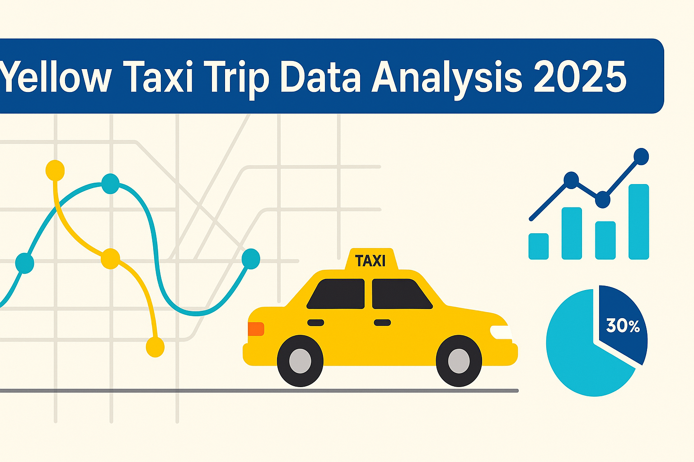

# 🚕 Yellow Taxi Trip Data Analysis 2025

[](https://www.python.org/)
[](https://pandas.pydata.org/)
[](https://opensource.org/licenses/MIT)
[](https://jupyter.org/)

## 📌 Overview

This project provides a comprehensive analysis of New York City's Yellow Taxi Trip dataset for 2025. Using Python's powerful data science ecosystem, we explore travel patterns, fare distributions, peak hours, and geographic trends through interactive visualizations and statistical analysis.

The analysis aims to uncover actionable insights for stakeholders, urban planners, and policymakers to better understand taxi usage patterns and optimize transportation services in NYC.

## 🎯 Project Objectives

- **Data Preprocessing**: Clean and prepare raw taxi trip data for analysis
- **Exploratory Data Analysis**: Investigate trip duration, distance, and fare patterns
- **Temporal Analysis**: Identify peak travel times and seasonal trends
- **Geographic Analysis**: Map pickup/drop-off hotspots across NYC boroughs
- **Statistical Insights**: Generate actionable insights for transportation optimization
- **Interactive Visualizations**: Create compelling charts and maps for stakeholder presentations

## 🛠️ Technologies Used

| Technology | Purpose |
|------------|---------|
| **Python 3.8+** | Core programming language |
| **Pandas** | Data manipulation and analysis |
| **NumPy** | Numerical computations and array operations |
| **Matplotlib** | Static plotting and basic visualizations |
| **Seaborn** | Statistical data visualization |
| **Plotly** | Interactive charts and geographic maps |
| **Jupyter Notebook** | Interactive development environment |

## 📊 Dataset Description

The Yellow Taxi Trip dataset contains detailed trip records with the following key fields:

| Field | Description |
|-------|-------------|
| `tpep_pickup_datetime` | Trip pickup timestamp |
| `tpep_dropoff_datetime` | Trip drop-off timestamp |
| `passenger_count` | Number of passengers |
| `trip_distance` | Trip distance in miles |
| `fare_amount` | Base fare amount |
| `tip_amount` | Tip amount |
| `total_amount` | Total trip cost |
| `PULocationID` | Pickup location zone ID |
| `DOLocationID` | Drop-off location zone ID |


## 🚀 Getting Started

### Prerequisites

- Python 3.8 or higher
- pip package manager
- Jupyter Notebook or JupyterLab

### Installation

1. **Clone the repository**
   ```bash
   git clone https://github.com/rashidul738/Yellow_Taxi_Trip_Data_Analysis_2025.git
   cd Yellow_Taxi_Trip_Data_Analysis_2025
   ```

2. **Create a virtual environment** (recommended)
   ```bash
   python -m venv taxi_analysis_env
   
   # On Windows
   taxi_analysis_env\Scripts\activate
   
   # On macOS/Linux
   source taxi_analysis_env/bin/activate
   ```

3. **Install required packages**
   ```bash
   pip install -r requirements.txt
   ```

   Or install packages individually:
   ```bash
   pip install pandas numpy matplotlib seaborn plotly jupyter
   ```

### Usage

1. **Launch Jupyter Notebook**
   ```bash
   jupyter notebook
   ```

2. **Run the analysis notebooks in order**
   - `01_data_loading_and_cleaning.ipynb` - Data preprocessing
   - `02_exploratory_data_analysis.ipynb` - Basic statistics and patterns
   - `03_temporal_analysis.ipynb` - Time-based trends
   - `04_geographic_analysis.ipynb` - Location-based insights
   - `05_advanced_visualizations.ipynb` - Interactive charts and maps

3. **Example code snippet**
   ```python
   import pandas as pd
   import numpy as np
   import matplotlib.pyplot as plt
   import seaborn as sns
   import plotly.express as px
   
   # Load the dataset
   df = pd.read_csv('data/yellow_taxi_2025.csv')
   
   # Basic statistics
   print(df.describe())
   
   # Trip duration analysis
   df['trip_duration'] = (df['tpep_dropoff_datetime'] - df['tpep_pickup_datetime']).dt.total_seconds() / 60
   
   # Visualize fare distribution
   plt.figure(figsize=(10, 6))
   sns.histplot(df['fare_amount'], bins=50, kde=True)
   plt.title('Distribution of Taxi Fares')
   plt.xlabel('Fare Amount ($)')
   plt.show()
   ```

## 📁 Project Structure

```
Yellow_Taxi_Trip_Data_Analysis_2025/
│
├── data/                          # Dataset files
│   ├── raw/                       # Original data files
│   └── processed/                 # Cleaned data files
│
├── notebooks/                     # Jupyter notebooks
│   ├── 01_data_loading_and_cleaning.ipynb
│   ├── 02_exploratory_data_analysis.ipynb
│   ├── 03_temporal_analysis.ipynb
│   ├── 04_geographic_analysis.ipynb
│   └── 05_advanced_visualizations.ipynb
│
├── src/                          # Source code modules
│   ├── data_processing.py        # Data cleaning functions
│   ├── visualization.py          # Custom plotting functions
│   └── analysis.py               # Statistical analysis functions
│
├── outputs/                      # Generated visualizations and reports
│   ├── figures/                  # Saved plots and charts
│   └── reports/                  # Analysis summaries
│
├── requirements.txt              # Python dependencies
├── README.md                     # Project documentation
├── LICENSE                       # MIT License
└── .gitignore                   # Git ignore rules
```

## 📈 Key Visualizations & Insights

### 🕐 Temporal Patterns
- **Rush Hour Analysis**: Peak demand occurs between 8-10 AM and 5-7 PM
- **Weekly Trends**: Higher activity on weekdays vs. weekends
- **Seasonal Variations**: Trip patterns change with weather and events

### 🗺️ Geographic Insights
- **Hotspot Mapping**: Manhattan shows highest pickup/drop-off density
- **Borough Analysis**: Trip distribution across NYC's five boroughs
- **Distance Patterns**: Average trip distances vary by pickup location

### 💰 Fare Analysis
- **Pricing Trends**: Fare variations by time, location, and distance
- **Tipping Behavior**: Tip percentages correlate with trip characteristics
- **Revenue Optimization**: Insights for dynamic pricing strategies

### 📊 Sample Visualizations

- Interactive heatmaps showing trip density across NYC
- Time series plots revealing hourly and daily demand patterns
- Fare distribution histograms with statistical overlays
- Geographic scatter plots with pickup/drop-off coordinates
- Correlation matrices highlighting feature relationships

## 🔍 Key Findings

- **Peak Hours**: Rush hour clusters between 8–10 AM and 5–7 PM show 40% higher trip volume
- **Geographic Patterns**: Midtown Manhattan accounts for 35% of all pickups
- **Fare Insights**: Certain neighborhoods show disproportionately high fares despite short distances
- **Tipping Behavior**: Average tip percentage varies from 15-22% based on location and time
- **Distance Trends**: Median trip distance has decreased by 8% compared to 2024 data

## 🚀 Future Enhancements

- [ ] **Weather Integration**: Correlate trip patterns with weather data
- [ ] **Traffic Analysis**: Incorporate real-time traffic information
- [ ] **Predictive Modeling**: Build ML models for demand forecasting
- [ ] **Dashboard Development**: Create interactive web dashboard using Streamlit/Dash
- [ ] **Real-time Analysis**: Implement streaming data processing
- [ ] **Comparative Studies**: Multi-year trend analysis

## 🤝 Contributing

Contributions are welcome! Here's how you can help:

1. **Fork the repository**
2. **Create a feature branch** (`git checkout -b feature/amazing-feature`)
3. **Commit your changes** (`git commit -m 'Add amazing feature'`)
4. **Push to the branch** (`git push origin feature/amazing-feature`)
5. **Open a Pull Request**

### Contribution Guidelines
- Follow PEP 8 style guidelines
- Add docstrings to new functions
- Include unit tests for new features
- Update documentation as needed

## 📋 Requirements

Create a `requirements.txt` file with:
```
pandas>=1.5.0
numpy>=1.21.0
matplotlib>=3.5.0
seaborn>=0.11.0
plotly>=5.0.0
jupyter>=1.0.0
scikit-learn>=1.0.0
folium>=0.12.0
```

## 📜 License

This project is licensed under the MIT License - see the [LICENSE](LICENSE) file for details.

## 📬 Contact & Support

**Author**: Rashidul Islam
- **GitHub**: [@rashidul738](https://github.com/rashidul738)
- **Email**: rashidul738@gmail.com

For questions, suggestions, or collaboration opportunities, feel free to reach out!

## 🙏 Acknowledgments

- NYC Taxi & Limousine Commission for providing the dataset
- Python data science community for excellent libraries
- Contributors and reviewers who helped improve this project

---

⭐ **If you found this project helpful, please give it a star!** ⭐